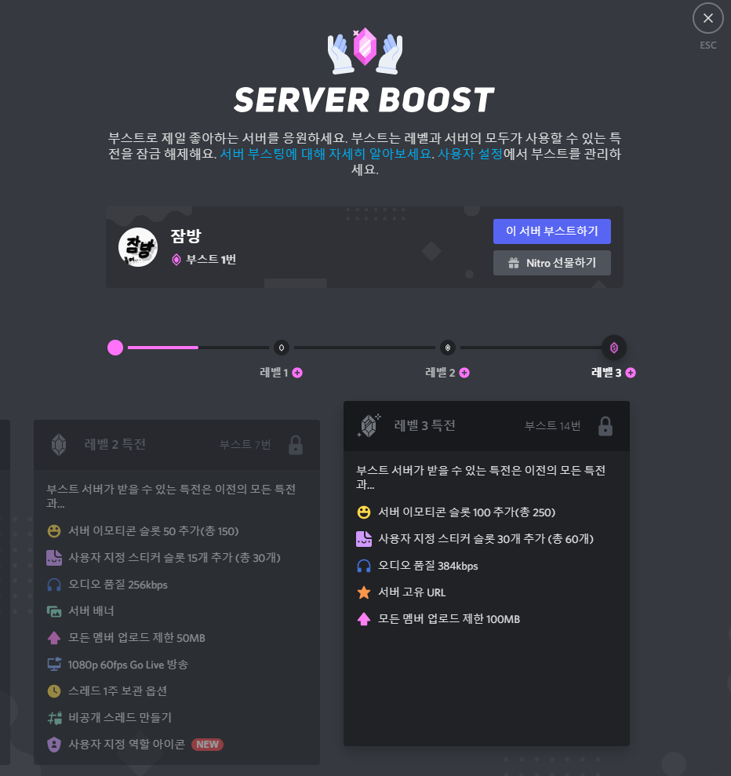

# 서버 부스트 개수 하향



### 기간: 2021년 8월 19일 이후

## 변경 내용

* 레벨 2 - 15번에서 7번으로 변경
* 레벨 3 - 30번에서 14번으로 변경

## 해당 기능을 얻기 위한 조건

* 불가능



### 기간: 2021년 8월 27일 이후

## 변경 내용

* 레벨 2 - 15번에서 7번으로 변경
* 레벨 3 - 30번에서 14번으로 변경

## 해당 기능을 얻기 위한 조건

* 무작위 서버를 대상으로 진행



### 기간: 2021년 9월 15일 이후

## 변경 내용

* 레벨 2 - 15번에서 7번으로 변경
* 레벨 3 - 30번에서 14번으로 변경

## 해당 기능을 얻기 위한 조건

* 모든 서버가 얻을 수 있음



## 업데이트 내용

#### Discord가 새로운 업데이트를 진행하였습니다. &#x20;

#### 서버 레벨 2와 서버 레벨 3이 각각 부스트 7, 14회로 변경되었습니다!

## 유저 반응

#### :blush: 유저 대부분이 이 업데이트에 만족하는 것으로 보입니다.

> #### :flag\_us: It's easier to reach levels 2 & 3 now!
>
> #### :flag\_kr: 이제 레벨 2 & 레벨 3을 달성하기 쉽네요!
>
> :link: Reddit 글에서 퍼옴  - [출처](https://www.reddit.com/r/discordapp/comments/ppdap8/its\_easier\_to\_reach\_levels\_2\_3\_now/)
